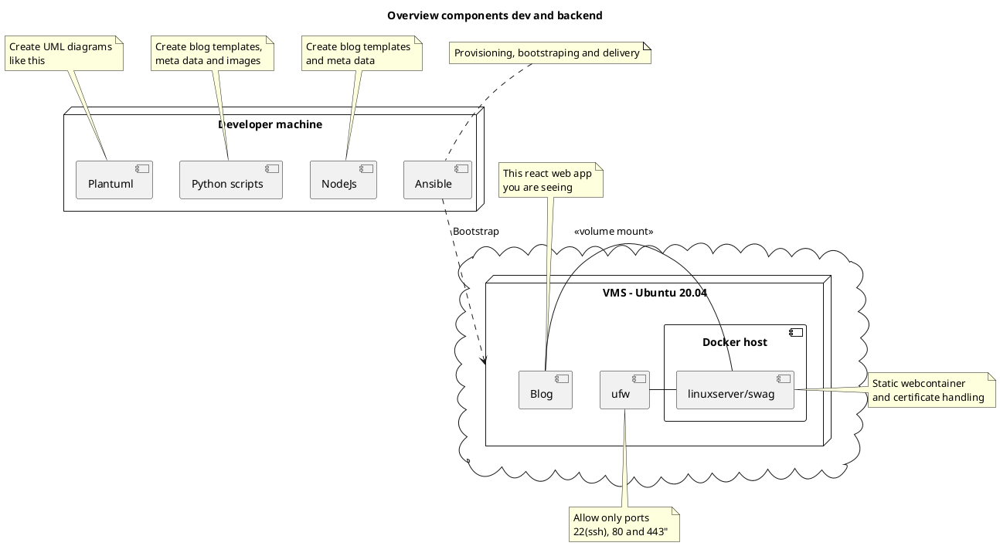

```meta
{
    "title": "Why to create another blog",
    "description": "Why and how I created this blog in detail",
    "tag": "generic",
    "created": "2020-09-05T18:46:02.412000+00:00",
    "updated": null,
    "id": "3QSZzBNiVMQVhnpjBcGHUw",
    "redditlink": "https://www.reddit.com/r/trenrodsblog/comments/ismqxy/why_to_create_another_blog/",
    "githublink": "https://github.com/Trenrod/blog"
}
```

## Reasons to do stuff

To learn something new as I never created nor used a blog before.

## Requirements I had to this blog

- Modern framework not to light and not to heavy but with typechecking **(React + Typescript)**
- Simple to use
  - Blog entries are written in **Markdown**
  - Createing a new blog as well as meta data is done by simple **Python** scripts
  - **Docker** image linuxserver/swag is used to run **Nginx** with **Certbot** to handle **Let`s Encrypt** certificates
- Must have features
  - UML diagrames in SVG are generated with **PlantUML** code embedded in the same markdown document
  - **P5js** is used to generated complex animations with code also embedded in the same markdown document
- Simple to maintain
  - **Ansible** is used for provisioning, bootstraping and delivery
  - No additional services like databases

This of course following flaws: (at least right now)
- No scalability
- Downtime during updates 

### Big picture

The component diagram below shows all components involed to create and maintain this blog.




### Source
Checkout public git repo for setup and more details [LINK TO GITHUB](https://github.com/Trenrod/blog)

